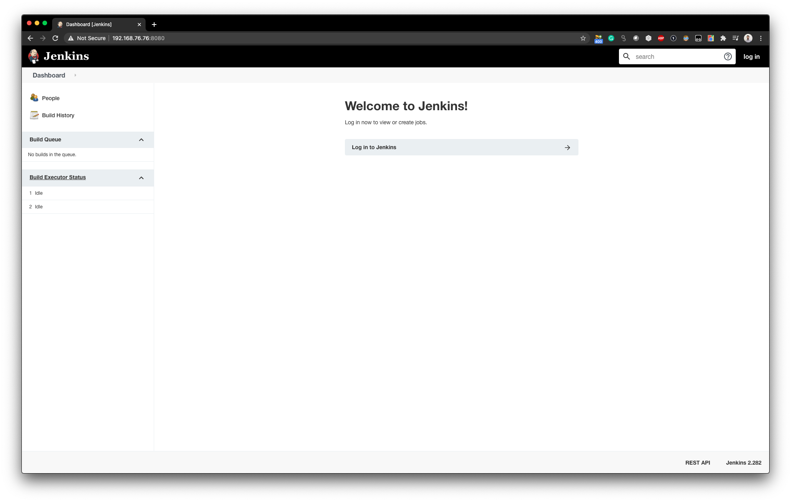

# vagrant-ansible-jenkins
Deployment of Jenkins on a VirtualBox Ubuntu VM using Vagrant and an Ansible playbook. 

Example of a vagrant VM deployment (with enabling root ssh and password), and 
ansible playbook associated in order to install Jenkins on the VM.

Can be used in order to do Jenkins tests locally or be extended to test other distribution / playbooks. 

This example is based on the example Jenkins CI of the book 'Ansible For DevOps'. I modified the example to: 
* make it work on MacOS, and 
* dissociated Vagrant provisioning and Ansible playbook.

Tested with the following versions: 
* Ansible 2.10.5
* Vagrant 2.2.7
* VirtualBox 6.0.12
* macOS Catalina 10.15.7

# Prerequisite: 
* Ansible
* Ansible galaxy
* Vagrant
* VirtualBox

# Installation: 
```
ansible-galaxy install -r requirements.yml
vagrant up
ansible-playbook -i inventory.yml provision.yml
```

We should have the Jenkins GUI available when visiting http://192.168.76.76:8080



We can then log in using the username/password: `admin/admin`


# Jenkins job
We can then create a job that will run the `main.yml` ansible-playbook locally on the Jenkins server. 
Example: 

1. `New Item` > Enter the name of the item > `Freestyle project` > `OK`
2. Under `Build Environment`, select `Color ANSI Console Output`
3. Under `Build` > `Add build step` > `Execute shell`. Add the following: 
```
# Force Ansible to output jobs with color. 
export ANSIBLE_FORCE_COLOR=true
# Run the local test playbook. 
ansible-playbook /opt/ansible-for-devops/main.yml
```
4. `Save`
5. `Build Now`
6. Under `Build History`, by clicking to the blue icon, we should have the following output: 
```
Started by user admin
Running as SYSTEM
Building in workspace /var/lib/jenkins/workspace/toto
[toto] $ /bin/sh -xe /tmp/jenkins1301434655789940856.sh
+ export ANSIBLE_FORCE_COLOR=true
+ ansible-playbook /opt/ansible-for-devops/main.yml
[WARNING]: provided hosts list is empty, only localhost is available. Note that
the implicit localhost does not match 'all'

PLAY [127.0.0.1] ***************************************************************

TASK [Check the date on the server.] *******************************************
changed: [127.0.0.1]

PLAY RECAP *********************************************************************
127.0.0.1                  : ok=1    changed=1    unreachable=0    failed=0    skipped=0    rescued=0    ignored=0   

Finished: SUCCESS
```